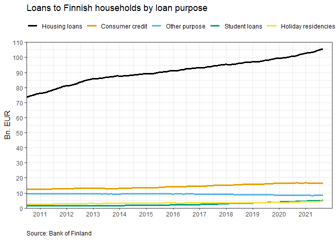
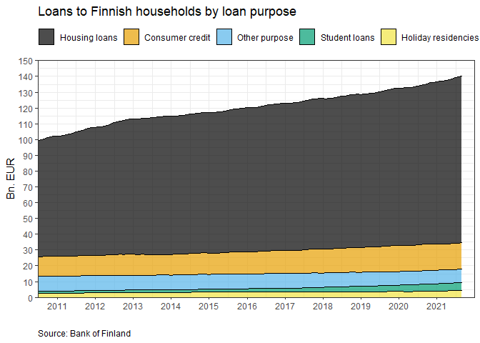

BOF Timeseries API example
==========================

    Script provides an example on how to use Bank of Finland's Timeseries statistics API (v3)
    Copyright (C) 2021 Antti Hirvonen

    This program is free software: you can redistribute it and/or modify
    it under the terms of the GNU General Public License as published by
    the Free Software Foundation, either version 3 of the License, or
    (at your option) any later version.

    This program is distributed in the hope that it will be useful,
    but WITHOUT ANY WARRANTY; without even the implied warranty of
    MERCHANTABILITY or FITNESS FOR A PARTICULAR PURPOSE.  See the
    GNU General Public License for more details.

    You should have received a copy of the GNU General Public License
    along with this program.  If not, see <https://www.gnu.org/licenses/>.

For additional information contact <Antti.Hirvonen@bof.fi> or <Ville.Tolkki@bof.fi>

API documentation is available at: <https://portal.boffsaopendata.fi/docs/services/rv-statistics-v3/operations/Dataset>

Timeseries API consists of four parts for accessing different information: available datasets, structures of the timeseries, list of available timeseries and list of timeseries observations. This document provides an example on how these can be used with R.

All available data through Timeseries API is licensed under [Creative Commons Attribution 4.0](https://creativecommons.org/licenses/by/4.0/).

Required libraries
------------------

``` r
## If you have not installed the libraries yet, the libraries can be installed by running following line:
## install.packages(c("httr", "jsonlite", "tidyverse", "scales", "lubridate", "plyr", "ggthemes"))
## Note that plyr package is required to be installed (for round_any function), but it is not recommended to be attached as library due to overlaps with dplyr
library(httr) ## tested version 1.4.2
library(jsonlite) ## tested version 1.7.2
library(tidyverse) ## tested version 1.3.0
library(scales) ## tested version 1.1.1
library(lubridate) ## tested version 1.7.10
library(ggthemes) ## tested version 4.2.4
```

Introduction to the contents of the API
---------------------------------------

### Datasets API

Information on the available datasets can be accessed via Datasets API:

``` r
## Retrieving the data with GET function
res_datasets <- GET("https://api.boffsaopendata.fi/v3/api/Datasets")
## Transforming the raw content of the result to readable format
df_datasets <- fromJSON(rawToChar(res_datasets$content))$datasets 
```

Let's print descripions of the datasets:

<table>
<caption>Datasets</caption>
<colgroup>
<col width="1%" />
<col width="98%" />
</colgroup>
<thead>
<tr class="header">
<th align="left">name</th>
<th align="left">description</th>
</tr>
</thead>
<tbody>
<tr class="odd">
<td align="left">IVF_PUBL</td>
<td align="left">The data set provides information on liabilities and assets collected from UCITS and non-UCITS funds registered in Finland. The data on fund share liabilities of is at fund type level. From the funds' assets, the data covers investments in fund shares, shares of equity, and bonds. The data is broken down into information on open-end and closed-end funds.</td>
</tr>
<tr class="even">
<td align="left">MFI_PUBL</td>
<td align="left">The data set provides information on loans and deposits, collected from credit institutions. The data covers loans and deposits in all currencies, converted into euro. Data are available on stocks, new drawdowns, new agreements and annualised agreed rates. Loans to households are broken down by the purpose of loan. For consumer credit, there is also information on the type of collateral. New drawdowns of loans to non-financial corporations are broken down by the size of loan. Deposits are broken down in deposits with agreed maturity, investment deposits and overnight deposits.</td>
</tr>
</tbody>
</table>

From now on the example will focus on contents of the MFI\_PUBL dataset, but the API could be used similarly with the IVF\_PUBL dataset as well.

### Structures API

Information on dimension codes and metadata of the timeseries can be accessed via Structures API. The main application of Structures API is to study the how the timeseries are structured. Let's retrieve structures of MFI\_PUBL timeseries.

``` r
## Request URL and parameter
structures_url <- "https://api.boffsaopendata.fi/v3/api/Structures/"
dataset <- "MFI_PUBL"
## Retrieving the data using GET function 
res_MFI_PUBL_structures <- GET(paste0(structures_url, dataset))

## Transforming the raw content of the result to readable format
df_structures <- fromJSON(rawToChar(res_MFI_PUBL_structures$content))
```

Let's take a closer look in the dimensions of the timeseries. In the case of MFI\_PUBL dataset, timeseries are formed of 18 dimensions that define contents of the series. These dimensions are separated by "." in the name of a series. For example timeseries of housing loan stock of Finnish households is named M.A.0.A.A20.A.A.U6.2251.ZZ.Z01.H.A.0.A.0.A.0.

Let's form a dataframe that allows further studying of the dimensions and dimension codes.

The dataframe `df_structures_dimensions_codes` consists of following columns:

-   `name`: name of the dimension
-   `description`: further description of the dimension
-   `position`: the position of the dimension
-   `codelistValues_value`: dimension code values
-   `codelistValues_description`: description of dimension code values

``` r
df_structures_dimensions_codes <- df_structures$dimensions %>%
  unnest(cols = codelistValues, names_sep = "_") %>%
  select(-c(codelist, codelistValues_sortOrder))
```

First, let's take a look at the 18 dimensions.

``` r
df_structures_dimensions <- df_structures_dimensions_codes %>%
  select(name, description, position) %>%
  unique()
```

Printing `df_structures_dimensions`:

| name                   | description                    |  position|
|:-----------------------|:-------------------------------|---------:|
| FREQ                   | Frequency                      |         1|
| REPORTER\_GROUP\_MFI   | MFI reporter group             |         2|
| MEASURE\_MFI           | MFI measure                    |         3|
| TRANSACTION\_TYPE\_MFI | MFI transaction type           |         4|
| BS\_ITEM\_MFI          | MFI balance sheet item         |         5|
| MATURITY\_ORIG\_MFI    | MFI original maturity          |         6|
| MATURITY\_REM\_MFI     | MFI remaining maturity         |         7|
| COUNT\_AREA            | Counterpart area               |         8|
| COUNT\_SECTOR\_MFI     | MFI counterparty sector        |         9|
| COUNT\_INDUSTRY\_MFI   | MFI counterparty industry      |        10|
| CURRENCY\_TRANS        | Currency of transaction        |        11|
| LOAN\_PURPOSE\_MFI     | MFI loan purpose               |        12|
| COLLATERAL\_TYPE\_MFI  | MFI collateral type            |        13|
| LOAN\_SIZE\_MFI        | MFI loan size                  |        14|
| INT\_RATE\_LINK\_MFI   | MFI interest rate linkage      |        15|
| INIT\_FIX\_PERIOD\_MFI | MFI initial period of fixation |        16|
| INT\_RESET\_TYPE\_MFI  | MFI Interest rate reset        |        17|
| NOTICE\_TYPE\_MFI      | MFI term of notice             |        18|

The table shows that first dimension of a series indicates the frequency (monthly or half-yearly), second indicates group that have reported the data (e.g. monetary financial institutions (MFIs) or deposit banks), third indicates measure (e.g. volume or annualised agreed interest rate) and so on.

Next, let's take a look at code values of a dimension. Suppose that the goal is to find data regarding housing loans. As the table above shows, loan purpose is located at 12th dimension of the timeseries. `df_structures_dimensions_codes` can be used to discover code values (and descriptions of the code values) that are used in the loan purpose dimension.

``` r
df_dimension_loan_purpose <- df_structures_dimensions_codes %>%
  filter(position == 12)
```

Printing `df_dimension_loan_purpose`:

<table style="width:100%;">
<caption>Loan purpose dimension</caption>
<colgroup>
<col width="15%" />
<col width="15%" />
<col width="8%" />
<col width="19%" />
<col width="40%" />
</colgroup>
<thead>
<tr class="header">
<th align="left">name</th>
<th align="left">description</th>
<th align="right">position</th>
<th align="left">codelistValues_value</th>
<th align="left">codelistValues_description</th>
</tr>
</thead>
<tbody>
<tr class="odd">
<td align="left">LOAN_PURPOSE_MFI</td>
<td align="left">MFI loan purpose</td>
<td align="right">12</td>
<td align="left">P</td>
<td align="left">Other consumption credit than vehicle loans</td>
</tr>
<tr class="even">
<td align="left">LOAN_PURPOSE_MFI</td>
<td align="left">MFI loan purpose</td>
<td align="right">12</td>
<td align="left">A</td>
<td align="left">Total</td>
</tr>
<tr class="odd">
<td align="left">LOAN_PURPOSE_MFI</td>
<td align="left">MFI loan purpose</td>
<td align="right">12</td>
<td align="left">C</td>
<td align="left">Consumption credit</td>
</tr>
<tr class="even">
<td align="left">LOAN_PURPOSE_MFI</td>
<td align="left">MFI loan purpose</td>
<td align="right">12</td>
<td align="left">H</td>
<td align="left">Housing loans</td>
</tr>
<tr class="odd">
<td align="left">LOAN_PURPOSE_MFI</td>
<td align="left">MFI loan purpose</td>
<td align="right">12</td>
<td align="left">M</td>
<td align="left">Other loans</td>
</tr>
<tr class="even">
<td align="left">LOAN_PURPOSE_MFI</td>
<td align="left">MFI loan purpose</td>
<td align="right">12</td>
<td align="left">N</td>
<td align="left">Not defined</td>
</tr>
<tr class="odd">
<td align="left">LOAN_PURPOSE_MFI</td>
<td align="left">MFI loan purpose</td>
<td align="right">12</td>
<td align="left">O</td>
<td align="left">Other purpose</td>
</tr>
<tr class="even">
<td align="left">LOAN_PURPOSE_MFI</td>
<td align="left">MFI loan purpose</td>
<td align="right">12</td>
<td align="left">R</td>
<td align="left">Holiday residencies</td>
</tr>
<tr class="odd">
<td align="left">LOAN_PURPOSE_MFI</td>
<td align="left">MFI loan purpose</td>
<td align="right">12</td>
<td align="left">S</td>
<td align="left">Student loans</td>
</tr>
<tr class="even">
<td align="left">LOAN_PURPOSE_MFI</td>
<td align="left">MFI loan purpose</td>
<td align="right">12</td>
<td align="left">K</td>
<td align="left">Consumption credit and other loans</td>
</tr>
<tr class="odd">
<td align="left">LOAN_PURPOSE_MFI</td>
<td align="left">MFI loan purpose</td>
<td align="right">12</td>
<td align="left">V</td>
<td align="left">Vehicle loans</td>
</tr>
<tr class="even">
<td align="left">LOAN_PURPOSE_MFI</td>
<td align="left">MFI loan purpose</td>
<td align="right">12</td>
<td align="left">I</td>
<td align="left">Investment property loans</td>
</tr>
<tr class="odd">
<td align="left">LOAN_PURPOSE_MFI</td>
<td align="left">MFI loan purpose</td>
<td align="right">12</td>
<td align="left">B</td>
<td align="left">Housing loans excl. investment property loans</td>
</tr>
</tbody>
</table>

The table shows that the dimension code for housing loans is "H". Alternatively, if the goal is to analyze investment property loans and other housing loans separately, codes "I" and "B" could be used for the 12th dimension as well.

Structures API includes also information on metadata associated with the timeseries. The metadata indicate e.g. the unit of the value of a timeseries. Let's form a dataframe which includes descriptions and codevalues of the associated metadata. The columns of the dataframe below are defined the same as in `df_structures_dimensions_codes`

``` r
## Transforming metadata information to cleaner format
df_structures_metadata_codes <- df_structures$metadatas %>%
  unnest(cols = codelistValues, names_sep = "_") %>%
  select(-c(codelist, codelistValues_sortOrder))
```

Descriptions of the associated metadata types:

``` r
df_structures_metadata <- df_structures_metadata_codes %>%
  select(name, description) %>%
  unique()
```

Printing the `df_structures_metadata`:

| name           | description          |
|:---------------|:---------------------|
| DECIMALS       | Decimals             |
| UNIT\_MULT     | Unit multiplier      |
| COLLECTION     | Collection indicator |
| UNIT           | Unit                 |
| SOURCE\_AGENCY | Source agency        |

Let's print code values and descriptions associated to "Unit" metadata using `df_structures_metadata_codes`:

| name | description | codelistValues\_value | codelistValues\_description |
|:-----|:------------|:----------------------|:----------------------------|
| UNIT | Unit        | EUR                   | Euro                        |
| UNIT | Unit        | PC                    | Percent                     |
| UNIT | Unit        | PCCH                  | Percentage change           |
| UNIT | Unit        | YEARS                 | Years                       |

Series API
----------

Next, let's take a look into Series API which contains list of all available timeseries (and list of dimension values and metadata associated to the series). It can be used to discover names of the timeseries that the user wants to retrieve.

There are two approaches to discovering names of the desired timeseries. The first option is to retrieve complete list of the available series and filter desired ones solely with R. However, it isn't necessary to retrieve complete list of available series if the user already knows that they are e.g. only interested in timeseries regarding households. In this case it is possible to filter the retrieved list with request parameter "seriesName".

Using `df_structures_dimensions` the user can find that 9th dimension of the series defines sector of the counterparty and using `df_structures_dimensions_codes` the user can discover that 2251 is the code value for the household sector. By setting "seriesName" equal to "%.%.%.%.%.%.%.%.2251.%.%.%.%.%.%.%.%.%" it's possible to allow that any other dimension can have any value but the 9th dimension needs to equal "2251".

Let's define a function that allows retrieving complete list of the available series or retrieving list of series that fulfill the filtering condition for the seriesName request parameter.

### get\_series\_list\_MFI\_PUBL

Description: This function returns list of available timeseries that fulfill the input condition and transforms the list to practical format such that it is possible to filter the list using dimension codes of the timeseries.

Inputs:

-   `frequency` (character string): code value of the frequency of the series (e.g. "M" i.e. monthly frequency)
-   `reporter_group` (character string): code value of the reporter group of the series (e.g. "A" i.e. MFIs excluding Bank of Finland)
-   `measure` (character string): code value of the measure of the series (e.g. "0" i.e. volume)
-   `transaction` (character string): code value of the transaction type of the series (e.g. "A" i.e. stock)
-   `item` (character string): code value of the balance sheet item (e.g. "A20" i.e. all loans)
-   `maturity_original` (character string): code value of original maturity of the item (e.g. "A" i.e. all maturities)
-   `maturity_remaining` (character string): code value of remaining maturity of the item (e.g. "A" i.e. all maturities)
-   `area` (character string): code value of the area of the counterparty (e.g. "U6" i.e. Finland)
-   `sector` (character string): code value of the sector of the counterparty (e.g. "2251" i.e. households)
-   `industry` (character string): code value of the industry of the counterparty (e.g. "ZZ" i.e. all industries)
-   `currency` (character string): code value of currency of the transaction (e.g. "Z01" i.e. all currencies)
-   `purpose` (character string): code value of the purpose of the loan (e.g. "A" i.e. all purposes)
-   `collateral` (character string): code value of the collateral type (e.g. "A" i.e. all collateral types)
-   `loan_size` (character string): code value of the loan size (e.g. "0" i.e. all loan sizes)
-   `interest_rate_linkage` (character string): code value of the interest rate linkage category (e.g. "A" i.e. all interest rate linkages)
-   `initial_period_of_fixation` (character string): code value of the initial period of fixation of the interest rate (e.g. "0" i.e. all periods)
-   `interest_rate_reset` (character string): code value for the interest rate reset period (e.g. "A" i.e. all periods)
-   `term_of_notice` (character string): code value for the term of notice of deposits (e.g. "0" i.e. all terms of notice)

All inputs are set to "%" (i.e. any value) by default.

Output:

-   `df_serieslist`: a dataframe with columns
    -   `name` (character string): name of the timeseries
    -   `title` (character string): definitions of the timeseries dimensions, separated by comma
    -   `COLLECTION` (character string): description of metadata collection indicator
    -   `UNIT` (character string): unit of the values of the timeseries
    -   `UNIT_MULT` (character string): unit multiplier of the values of the timeseries
    -   columns for all of the timeseries dimensions (character string, 18 columns in total): columns are named according to names of the codelists (see `name` column of `df_structures_dimensions`)

``` r
get_series_list_MFI_PUBL <- function(
    frequency = "%",
    reporter_group = "%",
    measure = "%",
    transaction = "%",
    item = "%",
    maturity_original = "%",
    maturity_remaining = "%",
    area = "%",
    sector = "%",
    industry = "%",
    currency = "%",
    purpose = "%",
    collateral = "%",
    loan_size = "%",
    interest_rate_linkage = "%",
    initial_period_of_fixation = "%",
    interest_rate_reset = "%",
    term_of_notice = "%") {
  
  ## Constructing filtering condition with inputs
  condition <- paste(
    frequency,
    reporter_group,
    measure,
    transaction,
    item,
    maturity_original,
    maturity_remaining,
    area,
    sector,
    industry,
    currency,
    purpose,
    collateral,
    loan_size,
    interest_rate_linkage,
    initial_period_of_fixation,
    interest_rate_reset,
    term_of_notice,
    sep = "."
    )
  
  ## Request URL and rest of the parameters
  series_url <- "https://api.boffsaopendata.fi/v3/api/Series/"
  dataset <- "MFI_PUBL"
  ## pageSize is set to 9999 to reassure that all of the specified series are retrieved
  page_size <- 9999
  
  ## Retrieving the data with GET function
  res_series <- GET(paste0(series_url, dataset),
                    query = list(
                      seriesName = condition,
                      pageSize = page_size
                      )
                    )
  
  ## Transforming the raw content of the result to readable format
  df_series <- fromJSON(rawToChar(res_series$content))$items
  
  ## Unnesting the list of dimensions and timeseries' metadata and pivoting metadata descriptions and dimension codes to columns
  df_serieslist <- df_series %>%
  unnest(cols = dimensions, names_sep = "_") %>%
  unnest(cols = metadatas, names_sep = "_") %>%
  select(
    name,
    title,
    dimensions_name,
    dimensions_value,
    metadatas_name,
    metadatas_description
  ) %>%
  pivot_wider(
    id_cols = c(name, title, dimensions_name, dimensions_value),
    names_from = metadatas_name,
    values_from = metadatas_description
  ) %>%
  pivot_wider(
    id_cols = c(name, title, COLLECTION, UNIT, UNIT_MULT),
    names_from = dimensions_name,
    values_from = dimensions_value
  ) %>%
  unique()
}
```

Suppose that the goal is to retrieve monthly data on Finnish households' loan stock by loan purpose including all currencies and maturities. The goal is to divide loans by loan purpose to five categories: housing loans (code H), consumption credit (code C), student loans (code S), holiday residency loans (code R) and loans with other purpose (code O). Let's reduce the size of the returned list of series by applying filters to `get_series_list_MFI_PUBL`.

``` r
## Retrieving the list of series
df_serieslist_filtered <- get_series_list_MFI_PUBL(
  ## Frequency: monthly
  frequency = "M",
  ## Reporter group: MFIs excluding Bank of Finland
  reporter_group = "A",
  ## Measure type: volume
  measure = "0",
  ## Transaction type: stock
  transaction = "A",
  ## Balance sheet item: all loans
  item = "A20",
  ## Original maturity: all maturities
  maturity_original = "A",
  ## Area: Finland
  area = "U6",
  ## Sector: households
  sector = "2251",
  ## Transaction currency: all currencies
  currency = "Z01")
```

Printing the names of the obtained series and loan purpose code values of the series from `df_serieslist_filtered`:

| name                                         | LOAN\_PURPOSE\_MFI |
|:---------------------------------------------|:-------------------|
| M.A.0.A.A20.A.A.U6.2251.ZZ.Z01.A.A.0.A.0.A.0 | A                  |
| M.A.0.A.A20.A.A.U6.2251.ZZ.Z01.H.A.0.A.0.A.0 | H                  |
| M.A.0.A.A20.A.A.U6.2251.ZZ.Z01.S.A.0.A.0.A.0 | S                  |
| M.A.0.A.A20.A.A.U6.2251.ZZ.Z01.O.A.0.A.0.A.0 | O                  |
| M.A.0.A.A20.A.A.U6.2251.ZZ.Z01.R.A.0.A.0.A.0 | R                  |
| M.A.0.A.A20.A.A.U6.2251.ZZ.Z01.M.A.0.A.0.A.0 | M                  |
| M.A.0.A.A20.A.A.U6.2251.ZZ.Z01.C.A.0.A.0.A.0 | C                  |
| M.A.0.A.A20.A.A.U6.2251.ZZ.Z01.V.A.0.A.0.A.0 | V                  |
| M.A.0.A.A20.A.A.U6.2251.ZZ.Z01.P.A.0.A.0.A.0 | P                  |
| M.A.0.A.A20.A.A.U6.2251.ZZ.Z01.B.A.0.A.0.A.0 | B                  |
| M.A.0.A.A20.A.A.U6.2251.ZZ.Z01.I.A.0.A.0.A.0 | I                  |

Table shows that there are more than five series left since any filters weren't applied to loan purpose prior. Let's finalize the filtering with R to end up with 5 series as was the goal.

``` r
## Finalizing the filtering with loan purposes
df_interesting_series <- df_serieslist_filtered %>%
  filter(LOAN_PURPOSE_MFI %in% c("H", "C", "O", "S", "R"))
```

It's also possible to retrieve complete list of all available series and execute the filtering solely with R:

``` r
## Retrieving complete list of series
df_series_list_unfiltered <- get_series_list_MFI_PUBL()

## Filtering the serieslist
df_interesting_series_v2 <- df_series_list_unfiltered %>%
  filter(
    FREQ == "M",
    REPORTER_GROUP_MFI == "A",
    MEASURE_MFI == "0",
    TRANSACTION_TYPE_MFI == "A",
    BS_ITEM_MFI == "A20",
    MATURITY_ORIG_MFI == "A",
    AREA_EE == "U6",
    COUNT_SECTOR_MFI == "2251",
    CURRENCY == "Z01",
    LOAN_PURPOSE_MFI %in% c("H", "C", "O", "S", "R")
  )
```

Printing the final list of filtered series, titles of the series and metadata associated to series:

<table>
<caption>Filtered series</caption>
<colgroup>
<col width="14%" />
<col width="76%" />
<col width="4%" />
<col width="1%" />
<col width="3%" />
</colgroup>
<thead>
<tr class="header">
<th align="left">name</th>
<th align="left">title</th>
<th align="left">COLLECTION</th>
<th align="left">UNIT</th>
<th align="left">UNIT_MULT</th>
</tr>
</thead>
<tbody>
<tr class="odd">
<td align="left">M.A.0.A.A20.A.A.U6.2251.ZZ.Z01.H.A.0.A.0.A.0</td>
<td align="left">Monthly, MFIs excl. Bank of Finland, Volume, Stock, Loans, Maturities total, Maturities total, Domestic (home or reference area), Households, Industries total, All currencies combined, Housing loans, Total, Total, Total, Total, Total, Total</td>
<td align="left">End of period</td>
<td align="left">Euro</td>
<td align="left">Millions</td>
</tr>
<tr class="even">
<td align="left">M.A.0.A.A20.A.A.U6.2251.ZZ.Z01.S.A.0.A.0.A.0</td>
<td align="left">Monthly, MFIs excl. Bank of Finland, Volume, Stock, Loans, Maturities total, Maturities total, Domestic (home or reference area), Households, Industries total, All currencies combined, Student loans, Total, Total, Total, Total, Total, Total</td>
<td align="left">End of period</td>
<td align="left">Euro</td>
<td align="left">Millions</td>
</tr>
<tr class="odd">
<td align="left">M.A.0.A.A20.A.A.U6.2251.ZZ.Z01.O.A.0.A.0.A.0</td>
<td align="left">Monthly, MFIs excl. Bank of Finland, Volume, Stock, Loans, Maturities total, Maturities total, Domestic (home or reference area), Households, Industries total, All currencies combined, Other purpose, Total, Total, Total, Total, Total, Total</td>
<td align="left">End of period</td>
<td align="left">Euro</td>
<td align="left">Millions</td>
</tr>
<tr class="even">
<td align="left">M.A.0.A.A20.A.A.U6.2251.ZZ.Z01.R.A.0.A.0.A.0</td>
<td align="left">Monthly, MFIs excl. Bank of Finland, Volume, Stock, Loans, Maturities total, Maturities total, Domestic (home or reference area), Households, Industries total, All currencies combined, Holiday residencies, Total, Total, Total, Total, Total, Total</td>
<td align="left">End of period</td>
<td align="left">Euro</td>
<td align="left">Millions</td>
</tr>
<tr class="odd">
<td align="left">M.A.0.A.A20.A.A.U6.2251.ZZ.Z01.C.A.0.A.0.A.0</td>
<td align="left">Monthly, MFIs excl. Bank of Finland, Volume, Stock, Loans, Maturities total, Maturities total, Domestic (home or reference area), Households, Industries total, All currencies combined, Consumption credit, Total, Total, Total, Total, Total, Total</td>
<td align="left">End of period</td>
<td align="left">Euro</td>
<td align="left">Millions</td>
</tr>
</tbody>
</table>

Observations API
----------------

At this it has been shown how to study structures of the timeseries and how to discover list of names of the series that the user is interested in. The next step is to retrieve the numeric data of. Let's define a function that retrieves the data using Observations API:

### get\_observation\_data

Description: This function returns observations for specified timeseries for specified time period and transforms the data to practical format.

Inputs:

-   `dataset` (character string): name of the dataset i.e. MFI\_PUBL or IVF\_PUBL
-   `series` (character string): Full name of the series or list of series names (separated by semicolon) or series name filter e.g. M.A.0.A.A20.A.A.U6.2251.ZZ.Z01.H.A.0.A.0.A.0 or %.U6.2251.ZZ.Z01.H.%
-   `period_start` (character string): start date of the timeseries (YYYY-MM-DD)
-   `period_end` (character string): end date the timeseries (YYYY-MM-DD)

Output:

-   `df_data`: a dataframe with columns
    -   `dataset` (character string): name of the dataset
    -   `name` (character string): name of the timeseries
    -   `period` (date object): date of the period (YYYY-MM-DD)
    -   `periodCode` (character string): date of the period (YYYY"M"MM)
    -   `value` (numeric): value of the observation
    -   `title` (character): definitions of the timeseries dimensions, separated by comma

``` r
get_observation_data <- function(
    dataset,
    series,
    period_start,
    period_end) {
  
  ## Retrieving the observation data
  res_observations <-
    GET(
      paste0(
        "https://api.boffsaopendata.fi/v3/api/Observations/",
        dataset
      ),
      query = list(
        seriesName = series,
        startPeriod = period_start,
        endPeriod = period_end
      )
    )
  
  ## Formatting the data as dataframe
  df_observations <- fromJSON(rawToChar(res_observations$content))$items %>%
    unnest(cols = observations) %>%
    mutate(period = as.Date(period))
  
  ## Retrieving information on timeseries codes
  res_series <- GET(
    paste0("https://api.boffsaopendata.fi/v3/api/Series/", dataset),
    query = list(seriesName = series)
    )
  
  ## Formatting the timeseries information as dataframe
  df_series <- fromJSON(rawToChar(res_series$content))$items %>%
    select(name, title) %>%
    unique
  
  ## Joining observation data and titles of the timeseries
  df_data <- left_join(df_observations, df_series, by = "name")
}
```

Let's use the function and retrieve the data starting from 2010Q2 to the latest observation.

``` r
## Defining inputs (request parameters) for the function:
dataset <- "MFI_PUBL"
## Collapsing names of the series to one string separated by semicolons
serieslist <- paste(df_interesting_series$name, collapse = ";")
first_period <- "2010-06-30"
last_period <- as.character(Sys.Date())

## Calling the function
df_data <- get_observation_data(
  dataset = dataset,
  series = serieslist,
  period_start = first_period,
  period_end = last_period
  )
```

Printing first five rows of `df_data`:

<table>
<caption>Retrieved data</caption>
<colgroup>
<col width="2%" />
<col width="13%" />
<col width="3%" />
<col width="3%" />
<col width="2%" />
<col width="73%" />
</colgroup>
<thead>
<tr class="header">
<th align="left">dataset</th>
<th align="left">name</th>
<th align="left">period</th>
<th align="left">periodCode</th>
<th align="right">value</th>
<th align="left">title</th>
</tr>
</thead>
<tbody>
<tr class="odd">
<td align="left">MFI_PUBL</td>
<td align="left">M.A.0.A.A20.A.A.U6.2251.ZZ.Z01.C.A.0.A.0.A.0</td>
<td align="left">2010-06-30</td>
<td align="left">2010M6</td>
<td align="right">12498.52</td>
<td align="left">Monthly, MFIs excl. Bank of Finland, Volume, Stock, Loans, Maturities total, Maturities total, Domestic (home or reference area), Households, Industries total, All currencies combined, Consumption credit, Total, Total, Total, Total, Total, Total</td>
</tr>
<tr class="even">
<td align="left">MFI_PUBL</td>
<td align="left">M.A.0.A.A20.A.A.U6.2251.ZZ.Z01.C.A.0.A.0.A.0</td>
<td align="left">2010-07-31</td>
<td align="left">2010M7</td>
<td align="right">12504.07</td>
<td align="left">Monthly, MFIs excl. Bank of Finland, Volume, Stock, Loans, Maturities total, Maturities total, Domestic (home or reference area), Households, Industries total, All currencies combined, Consumption credit, Total, Total, Total, Total, Total, Total</td>
</tr>
<tr class="odd">
<td align="left">MFI_PUBL</td>
<td align="left">M.A.0.A.A20.A.A.U6.2251.ZZ.Z01.C.A.0.A.0.A.0</td>
<td align="left">2010-08-31</td>
<td align="left">2010M8</td>
<td align="right">12569.01</td>
<td align="left">Monthly, MFIs excl. Bank of Finland, Volume, Stock, Loans, Maturities total, Maturities total, Domestic (home or reference area), Households, Industries total, All currencies combined, Consumption credit, Total, Total, Total, Total, Total, Total</td>
</tr>
<tr class="even">
<td align="left">MFI_PUBL</td>
<td align="left">M.A.0.A.A20.A.A.U6.2251.ZZ.Z01.C.A.0.A.0.A.0</td>
<td align="left">2010-09-30</td>
<td align="left">2010M9</td>
<td align="right">12536.07</td>
<td align="left">Monthly, MFIs excl. Bank of Finland, Volume, Stock, Loans, Maturities total, Maturities total, Domestic (home or reference area), Households, Industries total, All currencies combined, Consumption credit, Total, Total, Total, Total, Total, Total</td>
</tr>
<tr class="odd">
<td align="left">MFI_PUBL</td>
<td align="left">M.A.0.A.A20.A.A.U6.2251.ZZ.Z01.C.A.0.A.0.A.0</td>
<td align="left">2010-10-31</td>
<td align="left">2010M10</td>
<td align="right">12527.37</td>
<td align="left">Monthly, MFIs excl. Bank of Finland, Volume, Stock, Loans, Maturities total, Maturities total, Domestic (home or reference area), Households, Industries total, All currencies combined, Consumption credit, Total, Total, Total, Total, Total, Total</td>
</tr>
</tbody>
</table>

Visualization
-------------

Finally, as the numeric data has been retrieved, it's possible to visualize the data. Let's start by adding categorical variable for legends of the plots and by defining y-axis and x-axis values for the plots.

``` r
## Categorical variables for chart legends
df_plot <- df_data %>%
  mutate(
    loan_type = case_when(
      name == "M.A.0.A.A20.A.A.U6.2251.ZZ.Z01.H.A.0.A.0.A.0" ~ "Housing loans",
      name == "M.A.0.A.A20.A.A.U6.2251.ZZ.Z01.C.A.0.A.0.A.0" ~ "Consumer credit",
      name == "M.A.0.A.A20.A.A.U6.2251.ZZ.Z01.O.A.0.A.0.A.0" ~ "Other purpose",
      name == "M.A.0.A.A20.A.A.U6.2251.ZZ.Z01.S.A.0.A.0.A.0" ~ "Student loans",
      name == "M.A.0.A.A20.A.A.U6.2251.ZZ.Z01.R.A.0.A.0.A.0" ~ "Holiday residencies"
    ),
    loan_type = factor(loan_type, levels = c(
      "Housing loans",
      "Consumer credit", 
      "Other purpose",
      "Student loans",
      "Holiday residencies"
      )
    )
  )

## Defining variables to be used in visualizations
maxvalue_lineplot <- plyr::round_any(max(df_plot$value), accuracy = 10000, f = ceiling)
maxvalue_areaplot <- df_plot %>%
  select(period, value) %>%
  group_by(period) %>%
  summarise(maxvalue = sum(value)) %>%
  unlist(c()) %>%
  max() %>%
  plyr::round_any(., accuracy = 10000, f = ceiling)
min_date <- min(df_plot$period)
max_date <- ceiling_date(x = max(df_plot$period), unit = "year") - days(1)
```

### Line plot

``` r
df_plot %>%
  ggplot(aes(x = period, y = value, group = loan_type, color = loan_type)) +
  geom_line(size = 1.25) +
  theme_bw() + 
  labs(
    title = "Loans to Finnish households by loan purpose",
    x = "",
    y = "Bn. EUR",
    caption = "Source: Bank of Finland"
  ) +
  scale_y_continuous(
    expand = c(0, 0),
    limits = c(0, maxvalue_lineplot),
    breaks = breaks_extended(n = 12),
    labels = function(x) 
      format(x / 1000, scientific = FALSE)
  ) +
  scale_x_date(
    limits = c(min_date, max_date),
    expand = c(0, 0),
    date_labels = "%Y",
    date_breaks = "1 year"
  ) +
  scale_color_colorblind() +
  theme(
    legend.title = element_blank(),
    legend.position = "top",
    plot.caption = element_text(hjust = 0)
  )
```



### Stacked area plot

``` r
df_plot %>%
  ggplot(aes(x = period, y = value, fill = loan_type)) +
  geom_area(color = "black", alpha = 0.7) +
  theme_bw() +
  labs(
    title = "Loans to Finnish households by loan purpose",
    x = "",
    y = "Bn. EUR",
    caption = "Source: Bank of Finland"
  ) +
  scale_y_continuous(
    expand = c(0, 0),
    limits = c(0, maxvalue_areaplot),
    breaks = breaks_extended(n = 12),
    labels = function(x) 
      format(x / 1000, scientific = FALSE)
  ) +
  scale_x_date(
    limits = c(min_date, max_date),
    expand = c(0, 0),
    date_labels = "%Y",
    date_breaks = "1 year"
  ) +
  scale_fill_colorblind() +
  theme(
    legend.title = element_blank(),
    legend.position = "top",
    plot.caption = element_text(hjust = 0)
  )
```


